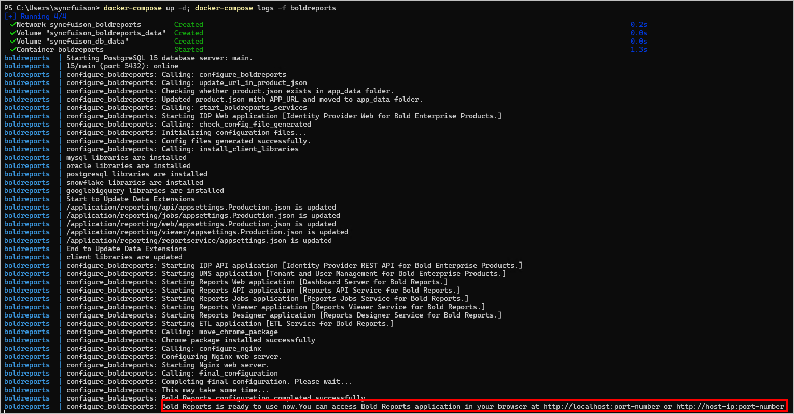
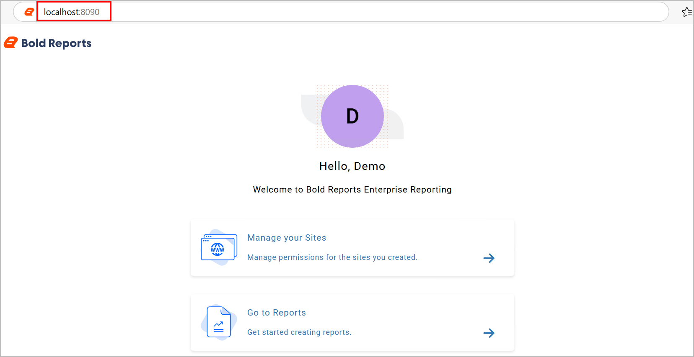

# How to deploy Bold Reports and configure startup manually?

In the following section, we will deploy a single container Bold Reports application using Docker Compose and manually configure the application startup.

## Bold Reports Deployment:

1. Download docker compose file using the following command.
   ```sh
   curl -o docker-compose.yml "https://raw.githubusercontent.com/boldreports/bold-reports-docker/master/deploy/single-container/docker-compose.yml"
   ```
2. Run docker compose up command.
   ```sh
   docker-compose up -d
   ```
   
   > **Note:** The docker volumes boldreports_data persists data of Bold Reports. [Learn more about docker volumes](https://docs.docker.com/storage/volumes/)
3.  Now, access the Bold Reports application by entering the URL as `http://localhost:8090` or `http://host-ip:8090` in the browser. When opening this URL in the browser, it will display the License page within a few seconds. The default port number mentioned in the compose file is 8090. If you are making changes to the port number, then you need to use that port number for accessing the Bold Reports application.

     
    > **Note:** The BoldReports site is not immediately available on port 80 because the containers are still being initialized and may take a couple of minutes for the first load.

### Application Startup

Configure the Bold Reports On-Premise application startup to use the application. Please refer the following link for more details on configuring the application startup.

https://help.boldreports.com/enterprise-reporting/administrator-guide/application-startup/

### Shutdown and Cleanup

The command `docker-compose down` removes the containers and default network, but preserves the volumes of Bold Reports and PostgreSQL.

The command `docker-compose down --volumes` removes the containers, default network, and all the volumes.